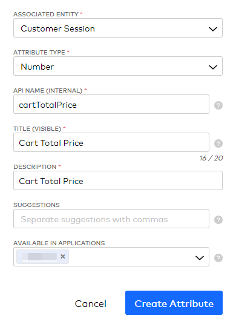
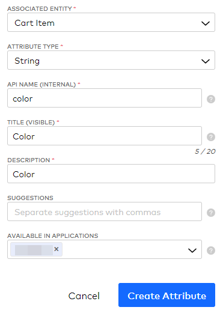
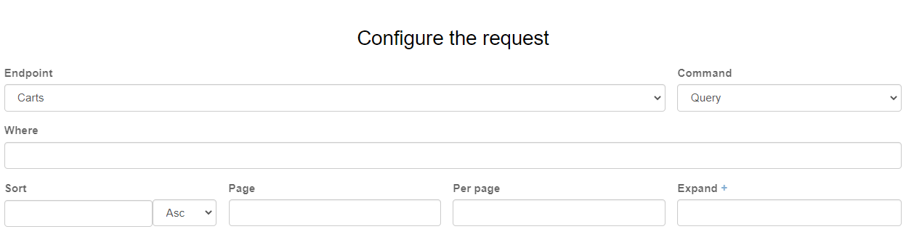
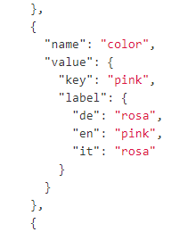

# Data Mapping Examples

## CART_ATTRIBUTE_MAPPING

We can map all data from
[Cart](https://docs.commercetools.com/api/projects/carts#cart).

For example, if you want to transfer a `centAmount` from `totalPrice` to
`cartTotalPrice` attribute as a number in Talon.One, you can set:

```
CART_ATTRIBUTE_MAPPING="totalPrice.centAmount:cartTotalPrice{number}"
```

Remember, that the `cartTotalPrice` must be defined in Talon.One
(Account > Dev Tools > Attributes) and assosiated with `Customer Session` entity.



## CART_ITEM_ATTRIBUTE_MAPPING

In this case, we must use values from `attributes` from
[ProductVariant](https://docs.commercetools.com/api/projects/products#productvariant)
and attributes in Talon.one assosiated with `Cart Item`, e.g.:



For example, if you want to transfer a `color` attribute from
Commercetools to the `color` attribute in Talon.One, you can set:

```
CART_ITEM_ATTRIBUTE_MAPPING="color.key:color"
```

The `color.key` path you can get from API (ImpEx):





As you can see, the mapping structure is quite different, because all
attributes before mapping were converted to something like this:

before (from CT):

```json
{
  "name": "color",
  "value": {
    "key": "pink",
    "label": {
      "de": "rosa",
      "en": "pink",
      "it": "rosa"
    }
  }
}
```

after (passed to mapping):

```json
{
  "color": {
    "key": "pink",
    "label": {
      "de": "rosa",
      "en": "pink",
      "it": "rosa"
    }
  }
}
```
