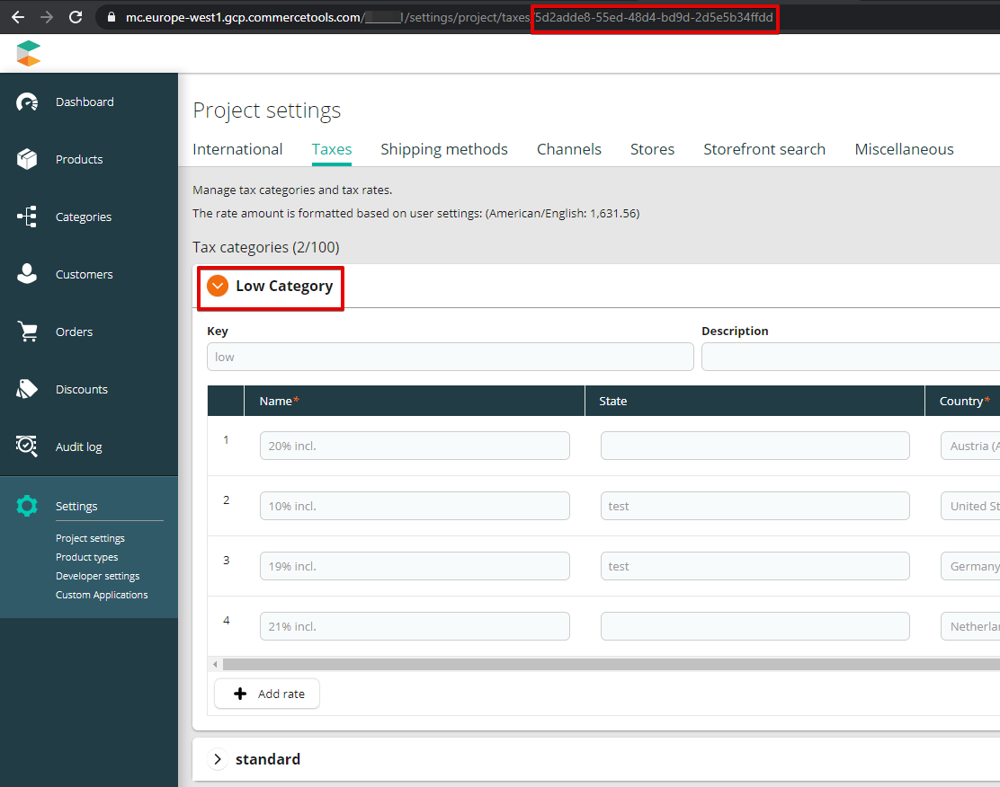

# DISCOUNT_TAX_CATEGORY_ID

[Tax category ID](https://docs.commercetools.com/api/projects/taxCategories)
in commercetools applied to discounts from Talon.One **(if you are using
discounts or coupons in Talon.One, this is mandatory option)**.

## How to set up

You can get the ID from [Merchant Center](#get-id-from-merchant-center).

### Get ID from Merchant Center

Go to the **Settings > Project settings** and switch tab to **Taxes**.
After clicking on the group that you are interested, the ID will be in
the URL like below.

